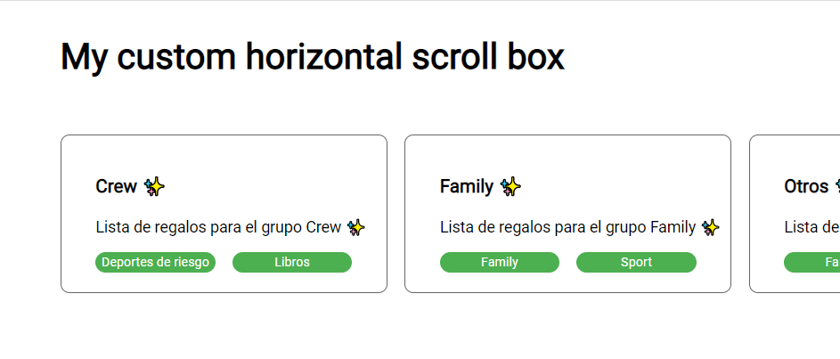

# JOBarcelona FrontEnd

Componente para ver una lista de grupos de regalos en modo de scroll horizontal (pc) y modo lista en versión móvil y tablet.

## Usage

Así luce el componente:



## API/Component

El componente tiene un título, una descripción y varias tags. Es responsive: adopta un modo de scroll horizontal en PC y un modo lista para tablet y móvil. Los tags también son componentes independientes.

## Installation

Antes de ejecutar, hay que instalar algunos paquetes; por tanto, ejecutaremos :

```bash
npm i
```

Y, para ejecutarlo (podemos usar cualquiera de los siguientes):

```bash
npm start
ng serve
```

## License

&copy; 2022 David Molina. [MIT](https://opensource.org/licenses/MIT).
